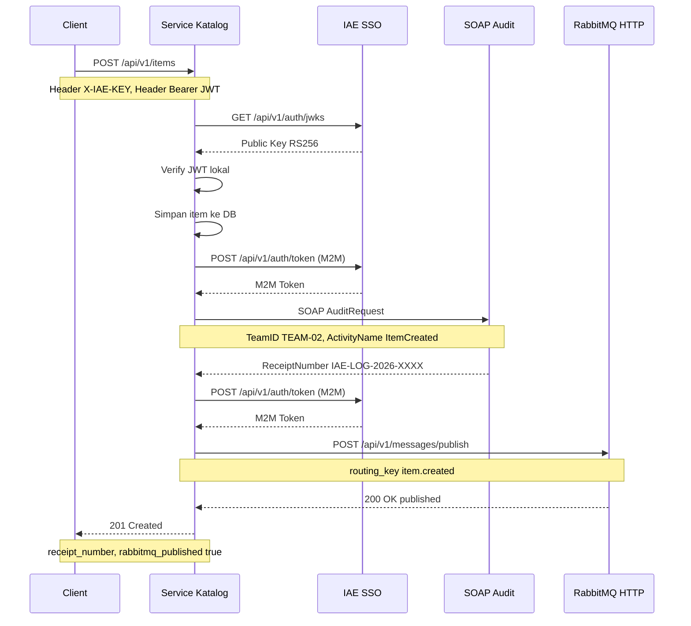

# Analisis Tugas 3 — Service Katalog Barang
**Nama**    : Rafly Zulfikar AlKautsar  
**NIM**     : 102022400192  
**Kelas**   : SI-48-08  
**Service** : Katalog Barang  
**Tema**    : Sistem Lelang  

---

## 1. Identifikasi Transaksi Kritis (SOAP)

### Transaksi yang Dipilih: Penambahan Item Baru
**Endpoint**: `POST /api/v1/items`

### Mengapa Ini Transaksi Kritis?
Penambahan item baru ke katalog lelang merupakan transaksi kritis karena:

1. **State-Changing**, Operasi ini mengubah state sistem secara permanen.
   Data item baru tersimpan di database dan langsung mempengaruhi
   ketersediaan barang lelang di seluruh ekosistem.

2. **Dampak Lintas Service**, Setelah item baru ditambahkan:
   - Service Penawaran (Bidding) baru bisa menerima bid untuk item tersebut
   - Service Pemenang & Invoice baru bisa memproses pemenang lelang

3. **Kritis Secara Bisnis** — Tanpa pencatatan item baru yang valid dan
   teraudit, integritas data inventori lelang tidak bisa dijamin. Setiap
   item yang masuk harus tercatat di sistem audit terpusat.

### Kesimpulan:
> Transaksi `POST /api/v1/items` (Penambahan Item Baru) dipilih sebagai
> transaksi kritis yang wajib dilaporkan ke sistem SOAP Audit karena
> bersifat state-changing dan berdampak langsung pada inventori lelang.

---

## 2. Identifikasi Event RabbitMQ

### Event yang Dipilih: `item.created`
**Trigger**: Setiap kali `POST /api/v1/items` berhasil dieksekusi

### Mengapa Event Ini Perlu Di-broadcast?
| Penerima Event | Kebutuhan |
|---|---|
| Service Penawaran | Perlu tahu ada item baru agar bisa menerima bid |
| Service Pemenang & Invoice | Perlu tahu ada item baru untuk persiapan penentuan pemenang |

### Payload Event:
```json
{
    "event": "item.created",
    "service": "Katalog-Service",
    "data": {
        "item_id": 15,
        "name": "Gitar Akustik Vintage",
        "starting_price": 25000000,
        "auction_status": "OPEN",
        "auction_deadline": "2026-09-01T18:00:00.000000Z"
    }
}
```

---

## 3. Sequence Diagram

### Alur Lengkap POST /api/v1/items dengan SSO, SOAP, dan RabbitMQ:


---

## 4. Skema Role Lokal (SSO Mapping)

Setelah JWT dari SSO dosen diverifikasi menggunakan public key RS256,
payload JWT akan di-decode dan informasi user disimpan ke dalam request
untuk digunakan oleh controller. Berikut mapping role yang diterapkan:

| Informasi JWT | Nilai | Keterangan |
|---|---|---|
| `sub` | `warga22@ktp.iae.id` | Email akun SSO |
| `token_type` | `user` | Tipe token yang digunakan |
| `profile.name` | `Vina Melati` | Nama karakter simulasi |
| `profile.nim` | `2026000022` | NIM karakter simulasi |

> **Catatan**: Pada Tugas 3 ini, validasi JWT difokuskan pada
> verifikasi keaslian token menggunakan RS256. Pemetaan role lokal
> akan dikembangkan lebih lanjut pada integrasi berikutnya.

---

## 5. Ringkasan Integrasi

| Modul | Teknologi | Endpoint | Trigger | Tujuan |
|---|---|---|---|---|
| **SSO** | JWT RS256 | `GET /api/v1/auth/jwks` | Setiap request `POST /api/v1/items` masuk | Validasi identitas user |
| **SOAP** | XML/HTTP | `POST /soap/v1/audit` | `POST /api/v1/items` berhasil simpan data | Audit transaksi kritis ke sistem legacy |
| **RabbitMQ** | AMQP/JSON | `POST /api/v1/messages/publish` | `POST /api/v1/items` berhasil simpan data | Broadcast event ke service lain |

---

## 6. Bukti Keberhasilan Integrasi

### Modul SSO
- Endpoint `POST /api/v1/items` hanya bisa diakses dengan Bearer JWT valid
- Tanpa token atau token tidak valid → response `401 Unauthorized`

### Modul SOAP
- Setiap penambahan item berhasil menghasilkan `receipt_number` dari sistem audit dosen
- Contoh: `IAE-LOG-2026-B3215A32`
- Log Laravel: `SOAP Audit berhasil {"activity":"ItemCreated","receipt_number":"IAE-LOG-2026-B3215A32"}`

### Modul RabbitMQ
- Pesan `item.created` dari **TEAM-02** berhasil muncul di Papan Pengumuman RabbitMQ dosen
- URL: `https://iae-sso.virtualfri.id/board`
- Log Laravel: `RabbitMQ publish berhasil {"event":"item.created",...}`
