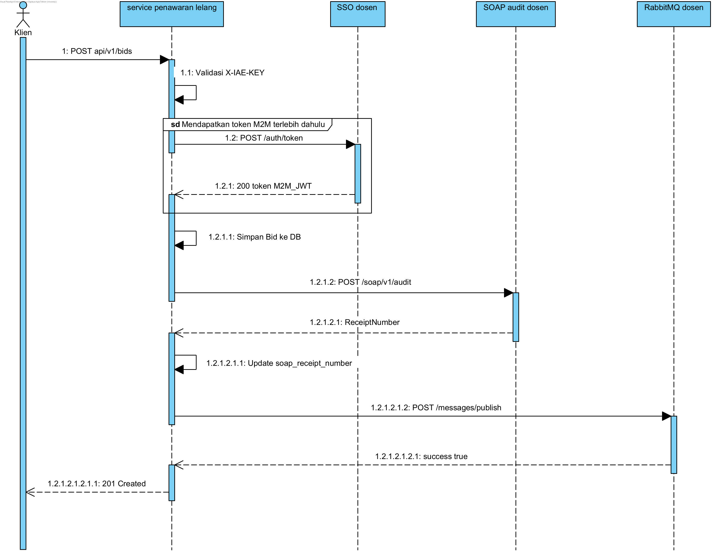

### Transaksi yang Dipilih -> `POST /api/v1/bids` (Mengajukan Penawaran)

Endpoint ini dipilih sebagai endpoint yang penting karena dia sendiri yang POST (menambahkan sesuatu) yang mengubah kondisi jadinya bakal memenuhi dua kategori penilaian sekaligus: transaksi yang diaudit (SOAP) dan transaksi yang disebarluaskan (RabbitMQ).

*Mengapa diaudit SOAP:*
- Setiap penawaran yang masuk mengubah keadaan lelang (siapa yang sedang memimpin penawaran).
- Nilai `bid_amount` sebagai pokok dari (Mengajukan Penawaran), sehingga harus tercatat di sistem audit terpusat agar nantinya tidak bisa dimanipulasi.
- Server dosen mengembalikan `ReceiptNumber` sebagai bukti audit resmi, yang disimpan secara lokal di kolom `bids.soap_receipt_number`.

*Mengapa disebarkan RabbitMQ:*
- Penawaran baru perlu segera diketahui oleh service lain (misalnya: service katalog untuk update status item, notifikasi untuk memberitahu peserta lain bahwa mereka tersalip, dan service pemenang untuk mempersiapkan proses checkout jika lelang berakhir).
- Komunikasi ini bersifat asinkron, service penawaran tidak perlu menunggu respons dari service lain, cukup broadcast `bid.placed` dan lanjut memproses request user.

Sebaliknya, endpoint `GET /api/v1/bids` dan `GET /api/v1/bids/{id}` tidak dipilih karena mereka hanya GET (read), sehingga tidak mengubah kondisi apapun jadinya mereka tidak memerlukan audit SOAP maupun broadcast AMQP.

---

- (POST /api/v1/bids) = Klien mengirim request penawaran baru berisi item_id dan bid_amount dengan header X-IAE-KEY.
- (Validasi X-IAE-KEY) = Service memverifikasi bahwa request berasal dari klien yang sah menggunakan API key lokal.
- (POST /auth/token) (hanya jika token M2M belum ada/expired) = Service meminta token M2M baru ke server SSO dosen menggunakan CENTRAL_TEAM_API_KEY.
- (200 token M2M_JWT) = Server SSO mengembalikan JWT M2M yang akan digunakan untuk autentikasi ke layanan SOAP dan RabbitMQ.
- (Simpan Bid ke DB) = Service menyimpan data penawaran baru ke tabel bids di database lokal.
- (POST /soap/v1/audit) = Service mengirim XML Envelope berisi data penawaran (BidPlaced) ke endpoint audit dosen dengan Bearer token M2M.
- (ReceiptNumber) = Server audit mengembalikan nomor resi (ReceiptNumber) sebagai bukti bahwa transaksi sudah tercatat secara resmi.
- (Update soap_receipt_number) = Service menyimpan ReceiptNumber tersebut ke kolom soap_receipt_number pada record bid yang baru dibuat.
- (POST /messages/publish) = Service mem-broadcast event bid.placed berisi detail penawaran ke message broker dosen agar diketahui departemen/service lain.
- (success true) = Broker mengonfirmasi bahwa event berhasil dipublikasikan tanpa error.
- (201 Created) = Service mengembalikan response akhir ke klien berisi data bid lengkap beserta soap_receipt_number sebagai tanda transaksi selesai dan teraudit.
